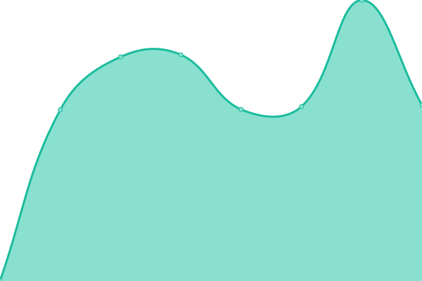

# [📈 Live Status](https://EC-Nordbund.github.io/uptime): <!--live status--> **🟩 All systems operational**

This repository contains the open-source uptime monitor and status page for [EC-Nordbund](ec-nordbund.de), powered by [Upptime](https://github.com/upptime/upptime).

With [Upptime](https://upptime.js.org), you can get your own unlimited and free uptime monitor and status page, powered entirely by a GitHub repository. We use [Issues](https://github.com/EC-Nordbund/uptime/issues) as incident reports, [Actions](https://github.com/EC-Nordbund/uptime/actions) as uptime monitors, and [Pages](https://EC-Nordbund.github.io/uptime) for the status page.

<!--start: status pages-->
<!-- This summary is generated by Upptime (https://github.com/upptime/upptime) -->
<!-- Do not edit this manually, your changes will be overwritten -->
<!-- prettier-ignore -->
| URL | Status | History | Response Time | Uptime |
| --- | ------ | ------- | ------------- | ------ |
|  [EC-Nordbund](https://www.ec-nordbund.de) | 🟩 Up | [ec-nordbund.yml](https://github.com/EC-Nordbund/uptime/commits/HEAD/history/ec-nordbund.yml) | 

 1230ms
     
 | 

<a href="https://EC-Nordbund.github.io/uptime/history/ec-nordbund">100.00%</a>
    

|  [VG](https://www.vg-sh.de) | 🟩 Up | [vg.yml](https://github.com/EC-Nordbund/uptime/commits/HEAD/history/vg.yml) | 

 1257ms
     
 | 

<a href="https://EC-Nordbund.github.io/uptime/history/vg">99.71%</a>
    

<!--end: status pages-->

[**Visit our status website →**](https://EC-Nordbund.github.io/uptime)

## 📄 License

- Powered by: [Upptime](https://github.com/upptime/upptime)
- Code: [MIT](./LICENSE) © [EC-Nordbund](ec-nordbund.de)
- Data in the `./history` directory: [Open Database License](https://opendatacommons.org/licenses/odbl/1-0/)
